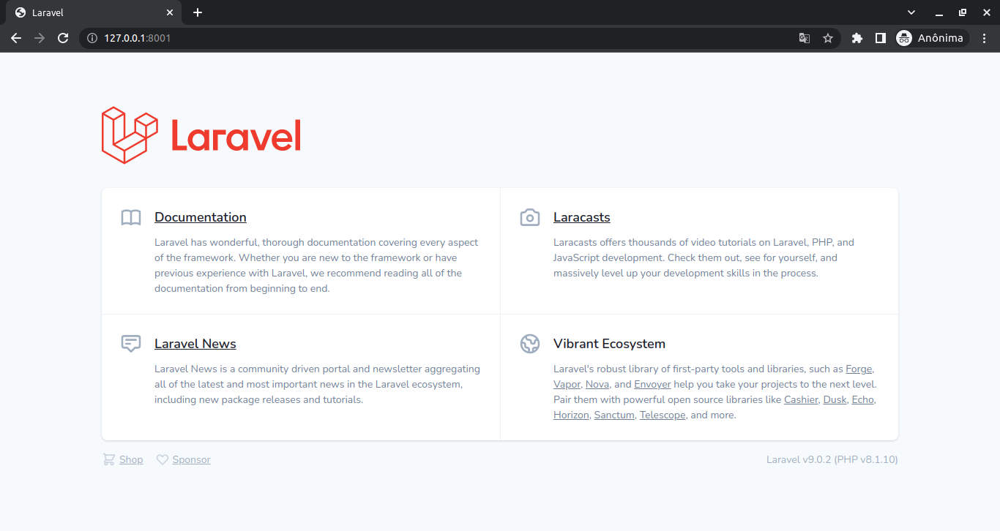
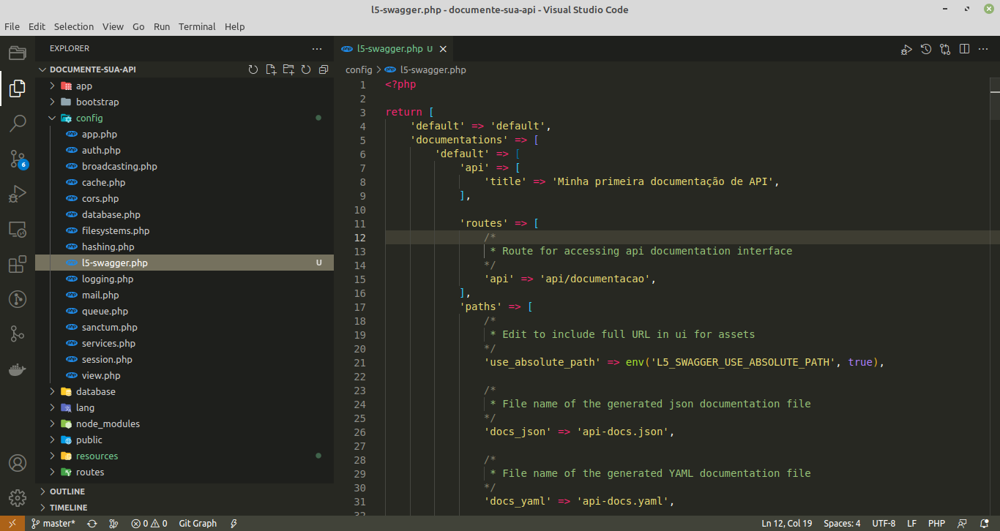
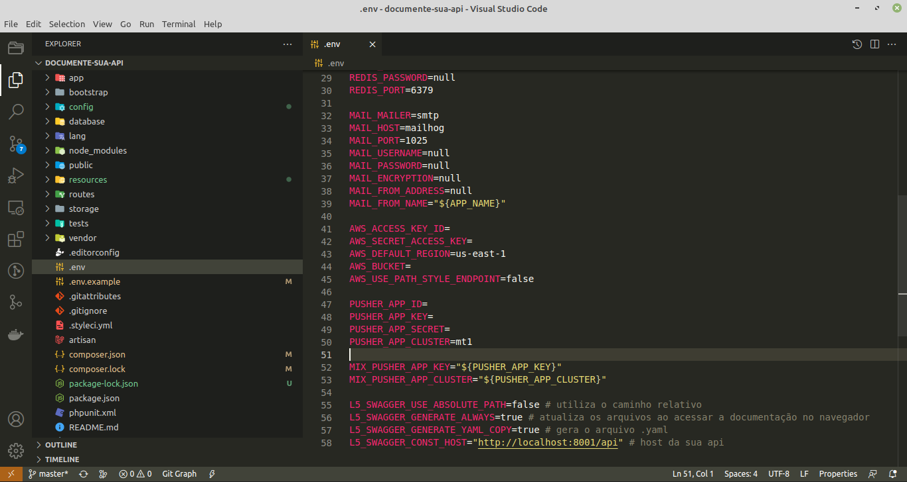
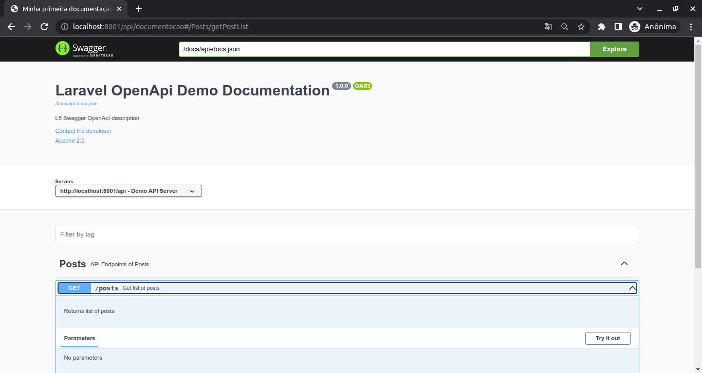

# Documente sua API Laravel com L5 Swagger

Com a popularização do home office e o aumento na busca por novos desenvolvedores, as documentações de APIs se tornaram muito necessárias quando falamos sobre a divisão de equipes em Backend e Frontend.

Sendo essencial para o controle de qualidade e processo, repasse de conhecimento e aumento da produtividade. Neste artigo apresentaremos para você o Laravel com L5 Swagger, uma biblioteca onde você poderá gerar sua documentação OpenAPI super interativa.

## Iniciando seu projeto

Utilizaremos neste tutorial o projeto: [SantriKoding-com Laravel-9-Restful-API](https://github.com/SantriKoding-com/Laravel-9-Restful-API)  com a versão do Laravel 9 para os testes deste processo.

Para iniciarmos, em seu terminal execute os comandos abaixo:

```
git clone https://github.com/SantriKoding-com/Laravel-9-Restful-API.git documente-sua-api
cd ./documente-sua-api
cp .env.example .env
composer install && npm install
touch database/database.sqlite
```

### Configurando o ambiente

Para fins didáticos utilizaremos o SQlite, sendo assim abra o arquivo .env e realize as seguintes alterações.

```
DB_CONNECTION=sqlite
#DB_HOST=127.0.0.1
#DB_PORT=3306
#DB_DATABASE=laravel
#DB_USERNAME=root
#DB_PASSWORD=
```

### Rodando seu projeto

Esta é a etapa que deixaremos o ambiente Laravel funcionando. No seu terminal execute os comandos abaixo:

```
php artisan key:generate
php artisan storage:link
php artisan migrate
php artisan serve --port=8001
```



### Instalando e configurando o L5 Swagger

Neste momento instalaremos o L5 Swagger, pois é uma combinação de Swagger-php e swagger-ui adaptado para trabalhar com Laravel e que é bem recomendado pela comunidade.

No seu terminal execute os comandos abaixo:

```
composer require darkaonline/l5-swagger
php artisan vendor:publish --provider "L5Swagger\L5SwaggerServiceProvider"
```

Um novo arquivo de configuração foi criado config/l5-swagger.php, existem diversas opções, porém iremos alterar apenas algumas:

- `Array documentations/default/api/title = 'Minha primeira documentação de API'`
- `Array documentations/routes/api = 'api/documentacao'`



Abra o arquivo .env e adicione as seguintes variáveis. Não esqueça de adicionar no .env.example, facilitará nas próximas instalações do seu projeto.

```
L5_SWAGGER_USE_ABSOLUTE_PATH=false # utiliza o caminho relativo
L5_SWAGGER_GENERATE_ALWAYS=true # atualiza os arquivos ao acessar a documentação no navegador
L5_SWAGGER_GENERATE_YAML_COPY=true # gera o arquivo .yaml
L5_SWAGGER_CONST_HOST="http://localhost:8001/api" # host da sua api
```



## Mão na massa

### Comentário/anotação: Global

Com o L5 Swagger é possível adicionar comentários globais, para isso, utilizaremos o controller base do Laravel (porém o mesmo precisa ter uma rota registrada).

Abra o arquivo `routes/api.php` e adicione o seguinte código:

```
<?php
use Illuminate\Support\Facades\Route;

//posts
Route::apiResource('/posts', App\Http\Controllers\Api\PostController::class);

// Adicione essa nova rota
Route::get('/', [App\Http\Controllers\Controller::class,'checkStatus']);
```

Abra o arquivo `app/Http/Controllers/Controller.php` e adicione o seguinte código:

- **version:** ***versão atual da sua API***
- **title:** ***título da sua API***
- **description:** ***descrição da sua API***
- **@OA\Tag:** ***agrupador de endpoints***

```
class Controller extends BaseController
{
   /**
   * @OA\Info(
   *   version="1.0.0",
   *   title="Laravel OpenApi Demo Documentation",
   *   description="L5 Swagger OpenApi description",
   *   @OA\Contact(
   *       email="admin@admin.com"
   *   ),
   *   @OA\License(
   *       name="Apache 2.0",
   *       url="http://www.apache.org/licenses/LICENSE-2.0.html"
   *   )
   * )
   *
   * @OA\Server(
   *   url=L5_SWAGGER_CONST_HOST,
   *   description="Demo API Server"
   * )
   *
   * @OA\Tag(
   *   name="Posts",
   *   description="API Endpoints of Posts"
   * )
   */
   use AuthorizesRequests, DispatchesJobs, ValidatesRequests;


   public function checkStatus()
   {
       return response(['status' => 'ok']);
   }
}
```

### Consultar todos os posts

Abra o arquivo `app/Http/Controllers/Api/PostController.php` e adicione o seguinte código acima da função “index”:

```
/**
* @OA\Get(
*   path="/posts",
*   operationId="getPostList",
*   tags={"Posts"},
*   summary="Get list of posts",
*   description="Returns list of posts",
*   @OA\Response(
*       response=200,
*       description="Successful operation",
*       ),
*   @OA\Response(
*       response=401,
*       description="Unauthenticated",
*   ),
*   @OA\Response(
*       response=403,
*       description="Forbidden"
*   )
* )
*/
public function index() {
   // ...
}
```

Neste ponto sua documentação já está funcional, para conferir basta acessar a url: http://localhost:8001/api/documentacao.

Nesta tela listará as informações de configurações e o endpoint GET “posts”.

Para testar basta clicar no botão ***Try out*** em seguida ***Execute*** (neste momento ainda não temos nenhum post cadastrado).



### Cadastrar um post

Abra o arquivo `app/Http/Controllers/Api/PostController.php` e adicione o seguinte código acima da função “store”:

```
/**
* @OA\Post(
*   path="/posts",
*   operationId="storePost",
*   tags={"Posts"},
*   summary="Store new post",
*   description="Returns post data",
*   @OA\RequestBody(
*       required=true,
*       @OA\MediaType(
*           mediaType="multipart/form-data",
*           @OA\Schema(
*               @OA\Property(
*                   description="File (jpeg,png,jpg,gif,svg)",
*                   property="image",
*                   type="string",
*                   format="file",
*               ),
*               @OA\Property(
*                   description="Title",
*                   property="title",
*                   type="string"
*               ),
*               @OA\Property(
*                   description="Content",
*                   property="content",
*                   type="string"
*               ),
*               required={"image", "title", "content"}
*           ),
*       ),
*   ),
*   @OA\Response(
*       response=201,
*       description="Successful operation",
*       ),
*   @OA\Response(
*       response=400,
*       description="Bad Request"
*   ),
*   @OA\Response(
*       response=401,
*       description="Unauthenticated",
*   ),
*   @OA\Response(
*       response=403,
*       description="Forbidden"
*   )
* )
*/
public function store(Request $request) {
   // ...
}
```

### Consultar o detalhe de um post

Abra o arquivo `app/Http/Controllers/Api/PostController.php` e adicione o seguinte código acima da função “show”:

```
/**
* @OA\Get(
*   path="/posts/{post}",
*   operationId="getPostById",
*   tags={"Posts"},
*   summary="Get post information",
*   description="Returns post data",
*   @OA\Parameter(
*       name="post",
*       description="Post id",
*       required=true,
*       in="path",
*       @OA\Schema(
*           type="integer"
*       )
*   ),
*   @OA\Response(
*       response=200,
*       description="Successful operation",
*       ),
*   @OA\Response(
*       response=400,
*       description="Bad Request"
*   ),
*   @OA\Response(
*       response=401,
*       description="Unauthenticated",
*   ),
*   @OA\Response(
*       response=422,
*       description="Unprocessable Entity"
*   )
* )
*/
public function show(Post $post) {
   // ...
}
```

### Atualizar um post

Abra o arquivo `app/Http/Controllers/Api/PostController.php` e adicione o seguinte código acima da função “update”:

> Observação: Como você perceberá abaixo nessa rota utilizaremos o método POST adicionando o atributo _method = PUT no corpo da requisição.

> O PHP tem uma limitação que utilizando o PUT não é possível acessar os arquivos enviados, caso contrário utilize @OA\Put.

#### Leia mais:

- [How to use PUT method in Laravel API with File Upload](https://stackoverflow.com/questions/65008650/how-to-use-put-method-in-laravel-api-with-file-upload)
- [PUT request data should be parsed just like POST](https://bugs.php.net/bug.php?id=55815)

```
/**
* @OA\Post(
*      path="/posts/{post}",
*      operationId="updatePost",
*      tags={"Posts"},
*      summary="Update existing post",
*      description="Returns updated post data",
*      @OA\Parameter(
*          name="post",
*          description="Post id",
*          required=true,
*          in="path",
*          @OA\Schema(
*              type="integer"
*          )
*      ),
*      @OA\RequestBody(
*      required=true,
*      @OA\MediaType(
*          mediaType="multipart/form-data",
*          @OA\Schema(
*              @OA\Property(
*                  description="File (jpeg,png,jpg,gif,svg)",
*                  property="image",
*                  type="string",
*                  format="file",
*              ),
*              @OA\Property(
*                  description="Title",
*                  property="title",
*                  type="string"
*              ),
*              @OA\Property(
*                  description="Content",
*                  property="content",
*                  type="string"
*              ),
*              @OA\Property(
*                  description="_method o valor deve ser PUT",
*                  property="_method",
*                  type="string"
*              ),
*              required={"image", "title", "content", "_method"}
*          ),
*      ),
*  ),
*      @OA\Response(
*          response=201,
*          description="Successful operation",
*      ),
*      @OA\Response(
*          response=400,
*          description="Bad Request"
*      ),
*      @OA\Response(
*          response=401,
*          description="Unauthenticated",
*      ),
*      @OA\Response(
*          response=422,
*          description="Unprocessable Entity"
*      )
* )
*/
public function update(Request $request, Post $post) {
   // ...
}
```

### Deletar um post

Abra o arquivo `app/Http/Controllers/Api/PostController.php` e adicione o seguinte código acima da função “destroy”:

```
/**
* @OA\Delete(
*      path="/posts/{post}",
*      operationId="deletePost",
*      tags={"Posts"},
*      summary="Delete existing post",
*      description="Deletes a record and returns no content",
*      @OA\Parameter(
*          name="post",
*          description="Post id",
*          required=true,
*          in="path",
*          @OA\Schema(
*              type="integer"
*          )
*      ),
*      @OA\Response(
*          response=204,
*          description="Successful operation",
*          @OA\JsonContent()
*      ),
*      @OA\Response(
*          response=401,
*          description="Unauthenticated",
*      ),
*      @OA\Response(
*          response=403,
*          description="Forbidden"
*      ),
*      @OA\Response(
*          response=404,
*          description="Resource Not Found"
*      )
* )
*/
public function destroy(Post $post) {
   //...
}
```

Basta acessar a url http://localhost:8001/api/documentacao, para que sua documentação seja atualizada.

Agora basta compartilhar com a sua equipe o .json ou .yaml gerados pelo L5 Swagger.

## Referências

- [QuickAdminPanel.com — Laravel API Documentation with OpenAPI/Swagger](https://blog.quickadminpanel.com/laravel-api-documentation-with-openapiswagger)
- [Github SantriKoding.com — Laravel 9 Restful API](https://github.com/SantriKoding-com/Laravel-9-Restful-API)
- [Santrikoding.com — Tutorial Restful API di Laravel 9](https://santrikoding.com/tutorial-restful-api-di-laravel-9-1-cara-install-laravel-9)
- [StackOverflow.com — How to use PUT method in Laravel API with File Upload](https://stackoverflow.com/questions/65008650/how-to-use-put-method-in-laravel-api-with-file-upload)
- [Twilio.com — Criar e consumir uma API RESTful no PHP Laravel](https://www.twilio.com/blog/criar-e-consumir-uma-api-restful-no-php-laravel )
